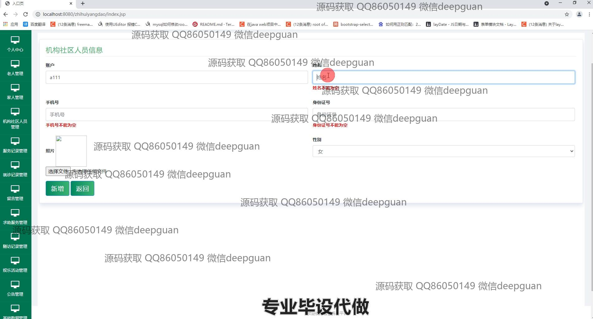
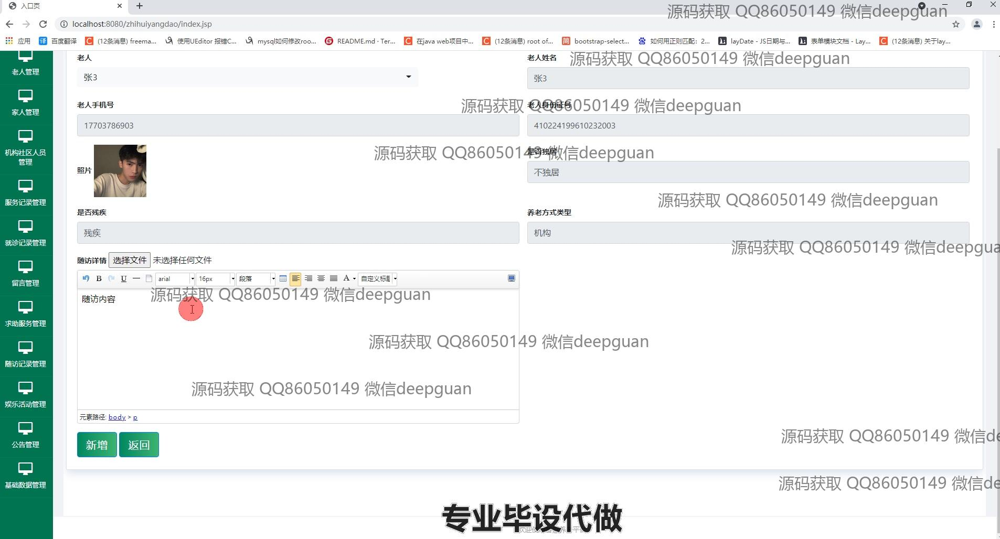
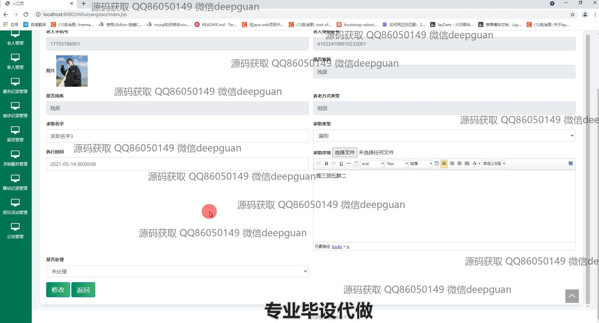

<h1 align="center">智慧养老平台的设计与实现</h1>

## 简介
智慧养老平台：角色分为管理员、用户；功能包括老人管理、家人管理、服务记录管理、公告管理、娱乐活动管理、就诊记录管理、求助服务管理。    --计算机毕业设计源码；毕设源码；java毕业设计源码

## 联系方式

<h3 align="center">获取完整代码与数据库文件 + 微信：deepguan QQ: 86050149 QQ群: 783742310</h3>

<h3 align="center">可帮忙远程部署 包运行成功！提供远程部署、修改代码、设计文档指导、代码讲解等服务！</h3>

## 功能介绍（完整见运行截图）
管理员：提供登录、注册、修改密码等基本功能。可通过导航菜单管理老人信息、家庭成员信息、机构及社区人员信息、娱乐活动及公告等内容。支持新增、修改、删除和查看详细信息，并提供服务记录查询、就诊记录管理、留言管理、求助服务管理和随访记录管理功能，为养老管理提供全方位支持。

用户：可登录个人中心查看及修改个人信息，包括密码重置和账户信息管理。支持通过平台添加或更新老人的个人信息、家庭成员信息及服务需求，并查看娱乐活动、公告及求助服务等信息，以便于个性化服务的获取和互动。

养老机构工作人员：可管理机构内老人的基本信息、健康状况、照片、养老方式及服务记录等内容，并提供详细服务跟踪。还可录入并维护社区活动及公告信息，支持活动类型选择和文本详情编辑，便于记录和推广社区服务内容。

平台访问者：通过平台首页浏览养老服务相关信息，包括公告列表、娱乐活动信息及服务项目详情，了解平台功能和使用情况，支持通过公告详情或其他页面模块获取更多信息。

## 运行截图

本代码来源于网络,仅供学习参考使用!

